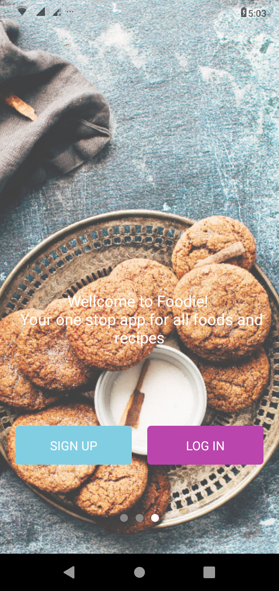
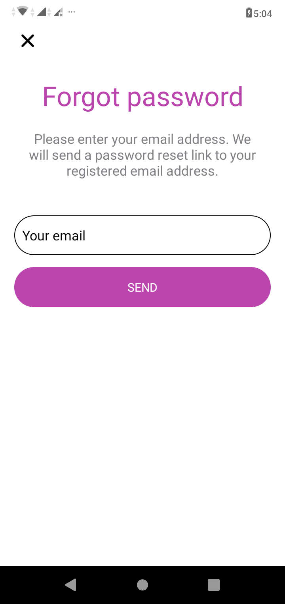
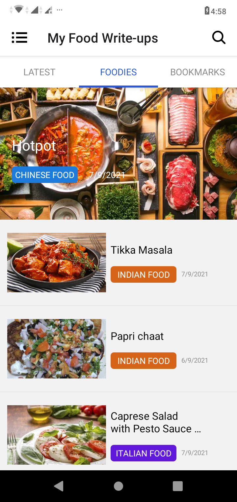
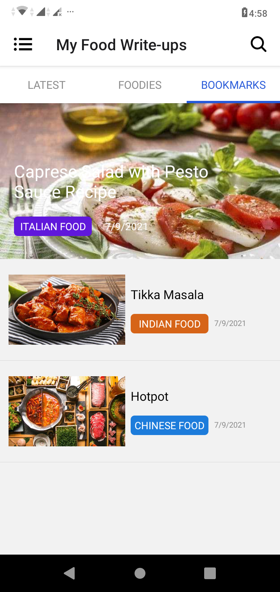
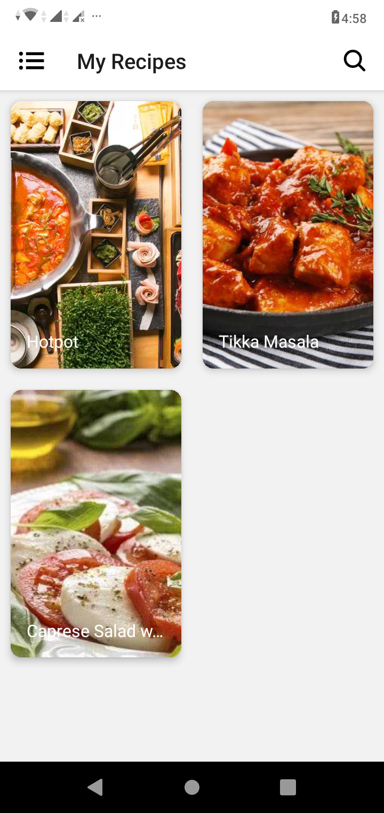
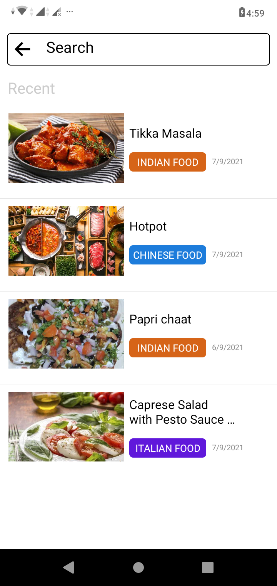
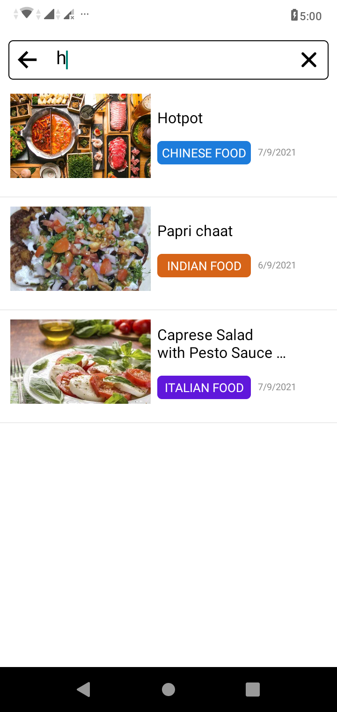

# Foodie

                                       

#Instructions

1. Clone the repo.
2. Run "npm install".
3. Add firebaseConfig in ./config/Firebase.ts.
4. Run "npm start" .

APK: https://drive.google.com/file/d/1AkxtPfCKZ_YxkR34CCPKngz7gSwTZPDR/view?usp=sharing
